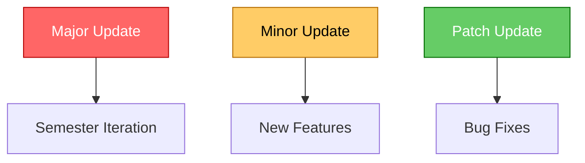

# Semantic Version Control

## UCM CSE PRG SemVer Conventions

### Overall Conventions

For most projects, you can simply use conventional commit messages and adhere to the established branching rules. When it’s time to release, the CI/CD pipeline will automatically parse commit messages and update the version accordingly.

### Versioning Guidelines

1. **MAJOR Version**:  
   - Updated manually by organization admins every semester.
   - Incomplete features are moved to the backlog for a potential release in the next major version.

2. **MINOR Version**:  
   - Increases with the addition of new features.
   - Multiple related features can be grouped together.

3. **PATCH Version**:  
   - Used for bug fixes.

### Automated Version Management

- **Python Projects**:  
  The [python-semantic-release](https://python-semantic-release.readthedocs.io/en/latest/) tool manages versioning. Versions are stored in git tags, `__version__.py`, and `pyproject.toml`.

- **NodeJS Projects** (e.g., Angular, NEXT.js):  
  The [semantic-release](https://semantic-release.gitbook.io) tool (implemented via [cycjimmy/semantic-release-action](https://github.com/cycjimmy/semantic-release-action) automates versioning. Versions are tracked using git tags and the `package.json` file.

### Conventional Commits
The [Conventional Commits](https://www.conventionalcommits.org) specification establishes simple rules for writing commit messages. This makes it easier to track changes and automate version updates in accordance with SemVer.

### CI/CD and Branching Strategy

Version updates occur only at the time of a package release, which is triggered automatically. Pull requests to the main branch initiate a test-build-release pipeline. During this process, semantic release actions parse commit messages and update the version, making adherence to the git branching strategy essential.

### Version Update Diagram

Below is a diagram illustrating the three types of semantic version updates as per UCM CSE PRG conventions:

---

# Contributing to CONTRIBUTING.md

First off, thanks for taking the time to contribute! ❤️

All types of contributions are encouraged and valued. See the [Table of Contents](#table-of-contents) for different ways to help and details about how this project handles them. Please make sure to read the relevant section before making your contribution. It will make it a lot easier for us maintainers and smooth out the experience for all involved. The community looks forward to your contributions. 🎉

> And if you like the project, but just don't have time to contribute, that's fine. There are other easy ways to support the project and show your appreciation, which we would also be very happy about:
> - Star the project
> - Tweet about it
> - Refer this project in your project's readme
> - Mention the project at local meetups and tell your friends/colleagues

## Table of Contents

- [Code of Conduct](#code-of-conduct)
- [I Have a Question](#i-have-a-question)
- [I Want To Contribute](#i-want-to-contribute)
- [Reporting Bugs](#reporting-bugs)
- [Suggesting Enhancements](#suggesting-enhancements)
- [Your First Code Contribution](#your-first-code-contribution)
- [Improving The Documentation](#improving-the-documentation)
- [Styleguides](#styleguides)
- [Commit Messages](#commit-messages)
- [Join The Project Team](#join-the-project-team)

## Code of Conduct

This project and everyone participating in it is governed by the
[Code of Conduct][coc].
By participating, you are expected to uphold this code. Please report unacceptable behavior
to <>.

## I Have a Question

> If you want to ask a question, we assume that you have read the available [Documentation]().

Before you ask a question, it is best to search for existing [Issues](/issues) that might help you. In case you have found a suitable issue and still need clarification, you can write your question in this issue. It is also advisable to search the internet for answers first.

If you then still feel the need to ask a question and need clarification, we recommend the following:

- Open an [Issue](/issues/new).
- Provide as much context as you can about what you're running into.
- Provide project and platform versions (nodejs, npm, etc), depending on what seems relevant.

We will then take care of the issue as soon as possible.

## I Want To Contribute

> ### Legal Notice 
> When contributing to this project, you must agree that you have authored 100% of the content, that you have the necessary rights to the content and that the content you contribute may be provided under the project license.

### Reporting Bugs

#### Before Submitting a Bug Report

A good bug report shouldn't leave others needing to chase you up for more information. Therefore, we ask you to investigate carefully, collect information and describe the issue in detail in your report. Please complete the following steps in advance to help us fix any potential bug as fast as possible.

- Make sure that you are using the latest version.
- Determine if your bug is really a bug and not an error on your side e.g. using incompatible environment components/versions (Make sure that you have read the [documentation](). If you are looking for support, you might want to check [this section](#i-have-a-question)).
- To see if other users have experienced (and potentially already solved) the same issue you are having, check if there is not already a bug report existing for your bug or error in the [bug tracker](issues?q=label%3Abug).
- Also make sure to search the internet (including Stack Overflow) to see if users outside of the GitHub community have discussed the issue.
- Collect information about the bug:
- Stack trace (Traceback)
- OS, Platform and Version (Windows, Linux, macOS, x86, ARM)
- Version of the interpreter, compiler, SDK, runtime environment, package manager, depending on what seems relevant.
- Possibly your input and the output
- Can you reliably reproduce the issue? And can you also reproduce it with older versions?

#### How Do I Submit a Good Bug Report?

> You must never report security related issues, vulnerabilities or bugs including sensitive information to the issue tracker, or elsewhere in public. Instead sensitive bugs must be sent by email to <>.

We use GitHub issues to track bugs and errors. If you run into an issue with the project:

- Open an [Issue](/issues/new). (Since we can't be sure at this point whether it is a bug or not, we ask you not to talk about a bug yet and not to label the issue.)
- Explain the behavior you would expect and the actual behavior.
- Please provide as much context as possible and describe the *reproduction steps* that someone else can follow to recreate the issue on their own. This usually includes your code. For good bug reports you should isolate the problem and create a reduced test case.
- Provide the information you collected in the previous section.

Once it's filed:

- The project team will label the issue accordingly.
- A team member will try to reproduce the issue with your provided steps. If there are no reproduction steps or no obvious way to reproduce the issue, the team will ask you for those steps and mark the issue as `needs-repro`. Bugs with the `needs-repro` tag will not be addressed until they are reproduced.
- If the team is able to reproduce the issue, it will be marked `needs-fix`, as well as possibly other tags (such as `critical`), and the issue will be left to be [implemented by someone](#your-first-code-contribution).

### Suggesting Enhancements

This section guides you through submitting an enhancement suggestion for CONTRIBUTING.md, **including completely new features and minor improvements to existing functionality**. Following these guidelines will help maintainers and the community to understand your suggestion and find related suggestions.

#### Before Submitting an Enhancement

- Make sure that you are using the latest version.
- Read the [documentation]() carefully and find out if the functionality is already covered, maybe by an individual configuration.
- Perform a [search](/issues) to see if the enhancement has already been suggested. If it has, add a comment to the existing issue instead of opening a new one.
- Find out whether your idea fits with the scope and aims of the project. It's up to you to make a strong case to convince the project's developers of the merits of this feature. Keep in mind that we want features that will be useful to the majority of our users and not just a small subset. If you're just targeting a minority of users, consider writing an add-on/plugin library.

#### How Do I Submit a Good Enhancement Suggestion?

Enhancement suggestions are tracked as [GitHub issues](/issues).

- Use a **clear and descriptive title** for the issue to identify the suggestion.
- Provide a **step-by-step description of the suggested enhancement** in as many details as possible.
- **Describe the current behavior** and **explain which behavior you expected to see instead** and why. At this point you can also tell which alternatives do not work for you.
- You may want to **include screenshots and animated GIFs** which help you demonstrate the steps or point out the part which the suggestion is related to. You can use [this tool](https://www.cockos.com/licecap/) to record GIFs on macOS and Windows, and [this tool](https://github.com/colinkeenan/silentcast) or [this tool](https://github.com/GNOME/byzanz) on Linux. 
- **Explain why this enhancement would be useful** to most CONTRIBUTING.md users. You may also want to point out the other projects that solved it better and which could serve as inspiration.

### Your First Code Contribution

### Improving The Documentation

## Styleguides
### Commit Messages

## Join The Project Team

## Attribution
This guide is based on the **contributing.md**. [Make your own](https://contributing.md/)!
